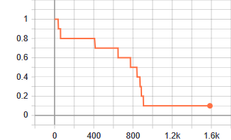
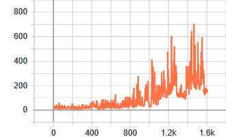

## Background

In Reinforcement Learning(RL) the core problem is often phrased as that of an agent learning to interact with an environment.
An agent's behaviour in an environment is defined by its policy. We will be looking into a subset of such algorithms known as on-policy algorithms.
Here the agent has only one single policy governing its movement in the environment. The agent uses the same policy to explore the environment and act in it.


## Exploration VS Exploitation

At any given point an agent can act greedily based on the information that it has to maximize the total rewards that its expects to obtain. This is also known as exploitation.

Exploitation comes with a major drawback. The agent acts only on the basis of its knowledge of the environment, which may be incomplete. This is especially problematic if an agent has just began its interaction with the environment. Acting only greedily based on it's limited knowledge of the environment is makes it very unlikely for agent to learn the optimal behaviour in the environment.

How will one know what lies behind door number 2 if one is satisfied with the reward it gets from door number 1?

This is where exploration comes in. When a agent explores it does not necessarily act to the best of its knowledge, instead it explores different options available, dictated by some exploration strategy.

What good is trying to know about what's behind every door if one never makes use of that information?

## Epsilon Greedy

Now that we are aware of the need to balance exploration and exploitation, we are ready to talk about Epsilon Greedy.
It is one of the most popular strategy to balance exploration and exploitation. Here is how it goes.

```markdown
ε is assigned a real number between 0 and 1.
With probability ε the agent chooses a random action.
With probability 1-ε the agent acts greedily.
```

Here we have established a strategy to exploit and explore based on a variable.
A value of ε closer to 1 will result in greater exploration
Conversely, a value closer to 0 will result greater exploitation.


### The Decay

It is also important to note that exploration is more important when the agent does not have enough information about the environment its interacting with. Once an agent does have the information it needs to interact optimally with the environment, allowing it to exploit its knowledge makes more sense.
We can thus see that the value of ε should decay across the life of an agent to have it learn and act optimally eventually.
A common way to obtain this by multiplying Epsilon by a real value less than 1 every episode. For example, `ε = ε*0.9`. This would result in a gradual decay in epsilon with more and more episodes.


### The Reward Based Decay

An alternate approach to epsilon decay that I found useful in certain problems is using the reward the decide the decay.
Only when an agent has crossed some reward threshold, the value of ε is reduced. Instead of assuming that the agent is learning more every episode. We wait for proof of agent’s learning before reducing the epsilon value. Thus we set higher targets for agent every time ε is lowered, and wait for agent to reach the newer target before repeating the same steps again.


## Code

Let us now take a look at how it would look in code.

### General pseudocode

```markdown
if EPSILON > MINIMUM_EPSILON and LAST_EPISODE_REWARD > MINIMUN_REWARD:    
    EPSILON -= DECAY_DELTA    
    MINIMUN_REWARD += REWARD_INCREMENT_DELTA
```

It is also possible to use decay and increment rates (demonstrated below) instead of doing so in chunks (as seen above)

```markdown
if EPSILON > MINIMUM_EPSILON and LAST_EPISODE_REWARD > MINIMUN_REWARD:    
    EPSILON *= EPSILON_DECAY_RATE   
    MINIMUN_REWARD *= REWARD_INCREMENT_RATE
```

### For a DQN trying to solve OpenAI's CartPole-v0

The problem is considered solved when the agent gets an average reward of 195 over 100 consecutive trials.
We start by initializing `EPSILON` and `MINREWARD` with values that seem suitable for the problem.

```markdown
EPSILON    = 1
MINREWARD = 30
```

At the end of each episode we conditionally adjust the values.

```markdown
if EPSILON > 0.2 and total_reward > MINREWARD:    
    EPSILON -= 0.1    
    MINREWARD += 20

```


## Results

The biggest advantage observed here is controlled epsilon decay across the life of an agent irrespective of how fast or slow the agent learns. Thus removing the reliance of decay on number of episodes.

Results of above code snippet in OpenAI's CartPole-v0 can be seen the graphs below.



_Epsilon on left, rewards on right. X-axis depicting episodes in both case._


## Intuition

Another way to interpret this decay strategy is based on responsibility. An agent is granted greater responsibility to act as it accomplishes greater rewards. Agent failing to meet the targets will be compelled to explore more until it does.


## Conclusion

While this decay strategy might not be suitable for a lot of environments and problem statements, it does bring few good to have benefits in cases where it does.
It removes a lot of uncertainty around the exploratory nature of an agent.
Should the agent be exploring more? Has the agent explored enough?
A reward based approach yields much easily understandable parameters which can be tweaked to get desired results.

The parameters here are more related to the environment and task than they are to an agent.
Agents, irrespective of their learning capabilities will get similar exploratory freedom at any given stage based on their accomplishments.
